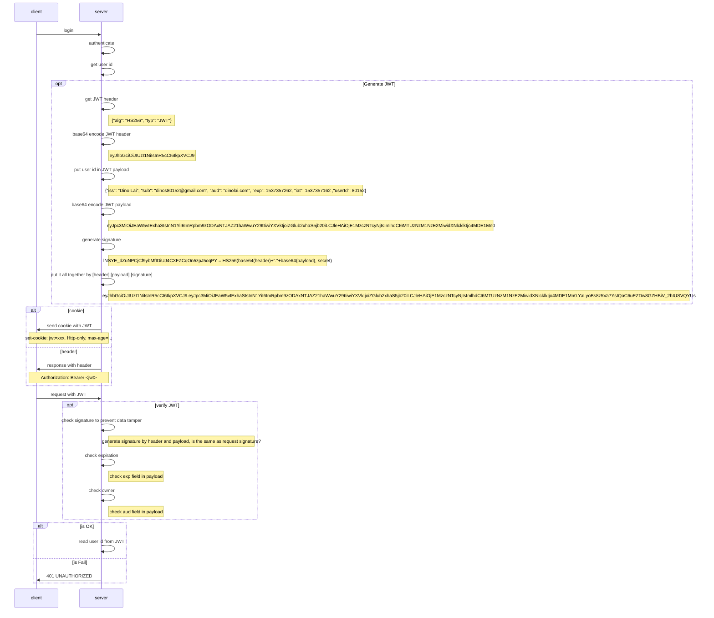

# JWT - JSON Web Token

## Purpose

Store data in client side, which could be read by can't be modified.

* Authentication
* Authorization

## Structure

base64(header).base64(payload).signature

`eyJhbGciOiJIUzI1NiIsInR5cCI6IkpXVCJ9`**.**`eyJpc3MiOiJEaW5vIExhaSIsInN1YiI6ImRpbm9zODAxNTJAZ21haWwuY29tIiwiYXVkIjoiZGlub2xhaS5jb20iLCJleHAiOjE1MzczNTcyNjIsImlhdCI6MTUzNzM1NzE2MiwidXNlcklkIjo4MDE1Mn0`**.**`YaLyoBs8z5Va7YsIQaC6uEZDw8GZHBiV_2hIUSVQYUs`

### Header

```json
{
    "alg": "HS256", // algorithm
    "typ": "JWT" // type
}
```

### Payload

```json
{
    "iss": "Dino Lai", // issuer
    "sub": "dinos80152@gmail.com", // subject
    "aud": "dinolai.com", // audience
    "exp": 1537357262, // expiration time
    "iat": 1537357162, // issued at
    "userId": 80152 // custom field
}
```

### Signature

Encrypt by algorithm defined in header

```sh
HmacSHA256(base64(header)+"."+base64(payload), $secret)
```

## Flow



## Comparison

| | JWT | Cookie | Session |
|-|-----|--------|---------|
|Side|Client|Client|Server|
|Visible| ○ | ○ | ❌ |
|Tamper| ❌ | ○ | ❌ |
|Identify| ○ | ❌ | ○ |
|additional resource|spend computing for en/decode, encrypt| | diskIO or network IO |

## Reference

* [JSON Web Tokens - jwt.io](https://jwt.io/)
* [JSON Web Token - 在Web应用间安全地传递信息](http://blog.leapoahead.com/2015/09/06/understanding-jwt/)
* [八幅漫画理解使用JSON Web Token设计单点登录系统](http://blog.leapoahead.com/2015/09/07/user-authentication-with-jwt/)